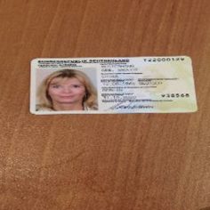
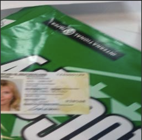
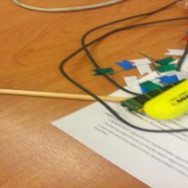
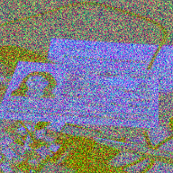
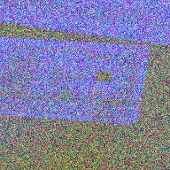
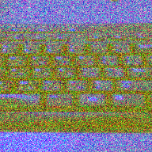

***


# Classifying the visibility of ID cards in photos 
### * Antonios Ntelidakis. email: antonis.del@gmail.com 
### * 1 June 2020
### * All rights of this work, including code, notebooks, text and ideas are reserved 
***

Recently I was engaged in a deep learning computer vision classification challenge. In this case study the task was to classify on image based on how visible the object of interest is. In particual we were classifying how visible an ID card is in the scene.

The folder images inside data contains several different types of ID documents taken in different conditions and backgrounds. The goal is to use the images stored in this folder and to design an algorithm that identifies the visibility of the card on the photo (FULL_VISIBILITY, PARTIAL_VISIBILITY, NO_VISIBILITY).

The challenge was inspired by a research publication for documents analysis, in particular the MIDV-500 dataset ([link](https://arxiv.org/abs/1807.05786)). To understand what each visibility type means, consider the following examples:

| FULL_VISIBILITY | PARTIAL_VISIBILITY | NO_VISIBILITY |
| --- | --- | --- |
|  |  | |


However the challenge had a plot twist. All the provided images are heavily noisy and corrupted. Neverthelss an annotation file is provided.

| FULL_VISIBILITY | PARTIAL_VISIBILITY | NO_VISIBILITY |
| --- | --- | --- |
|  |  | |


More interesting the requirement of the task was to: 
1. load the images and tranform them into a single channel numpy array, and 
2. the Machine Learning Model must take single-channel images as input.

This pretty much enforces to devise a custom neural network architecture as all the popular open source deep learning classifiers assume a 3 channel images (e.g. ResNets, Inception, EfficienNets etc).

The case study is broken into 3 notebooks for the following tasks:
* [Data Exploration](https://htmlpreview.github.io/?https://github.com/antelidakis/dlcv_id_challenge/blob/main/notebooks/a_data_exploration.html)
* [Feature Engineering](https://htmlpreview.github.io/?https://github.com/antelidakis/dlcv_id_challenge/blob/main/notebooks/b_feature_engineering.html)
* [Model Training / Validation](https://htmlpreview.github.io/?https://github.com/antelidakis/dlcv_id_challenge/blob/main/notebooks/c_i_train_cnn_grayscale_jit_data_gen_upsampling.html)


## Data

Inside the data folder you can find the following:

### 1) Folder images
A folder containing the challenge images.

### 2) gicsd_labels.csv
A CSV file mapping each challenge image with its correct label.
	- **IMAGE_FILENAME**: The filename of each image.
	- **LABEL**: The label of each image, which can be one of these values: FULL_VISIBILITY, PARTIAL_VISIBILITY or NO_VISIBILITY.
    
### 3) Folder infer_test_images
A folder containing some test images for demo purposes


## Dependencies

Please install an anaconda environment using the official instractions based on your OS: [link](https://docs.anaconda.com/anaconda/install/)

Once installation is complete open a new terminal and type the following commands. These commands create an anaconda virtual enviroment, activate the enviroment and then install the dependencies of the case study.

```
$ conda create -n ds_env python=3.7 anaconda
$ conda activate ds_env
$ conda install tensorflow protobuf=3.8.0
$ conda install opencv
$ conda install jupyter
$ conda install matplotlib
```
You will need to activate the python environment in order to execute the notebooks and the python scripts.


## Run Instructions

The instructions of the case study required to split the tasks int 3 python notebook files as well as python scripts that would perform the training and the prediction tasks of the challenge.

### Notebooks
In particular to the notebooks, they are placed in the `notebooks` folder. You will find the following notebooks as well as associated html instances:
* [Data Exploration](https://htmlpreview.github.io/?https://github.com/antelidakis/dlcv_id_challenge/blob/main/notebooks/a_data_exploration.html) - The data exploration notebook which details findings on the original data, that lead to feature engineering approaches and decisions made, as well as why a traditional geometric computer vision solution would not work. For the latter a simple solution is provided within the notebook. The notebook also allows the generation -using the original dataset- of pre-processed images for debug/inspection purposes. 
* [Feature Engineering](https://htmlpreview.github.io/?https://github.com/antelidakis/dlcv_id_challenge/blob/main/notebooks/b_feature_engineering.html) - This notebook formulates the feature engineering pipeline to prepare the data for training a vgg like custom neural network for classification. It provide details of the approach used as well as a worked example to pre-process a 3 channel image.
* [Model Training / Validation](https://htmlpreview.github.io/?https://github.com/antelidakis/dlcv_id_challenge/blob/main/notebooks/c_i_train_cnn_grayscale_jit_data_gen_upsampling.html) - This notebooks details the creation of an ML model. It allows to create an ML model which classifies the visibility (FULL_VISIBILITY, PARTIAL_VISIBILITY, NO_VISIBILITY) of the card in the photo. 
Two different approaches are provided: 
    1. *baseline* one where an imbalanced dataset is upsampled and 
    2. *traditional* one that training is performed assuming the dataset is balanced. 

#### Model training/evaluation sidenotes
The user can (i) execute the complete training pipeline, (ii) review evaluation results, (iii) save the model in the artifact directory, and (iv) reload the model to perform sanity checks. We mirror the train/predict functionality in python scripts found in the `code` folder. Please note that the `train.py` script provided in the code mirrors the training and evaluation functionality. The `predict.py` script mirrors the steps performed for prediction on an image once a model is loaded. 

Finally, we provide 4 different html files for this notebook for 4 different (data augmentations) training pipelines.


#### The notebooks communicate thoroughly (text, visualizations, poc code) my approach and the choices made during this case study. Running throught the notebooks is vital for a deep understanding on the choices made.

### Python scripts/modules
In particular to the python scripts, these are placed in the `code` folder. Two python scripts are provided as per the guidelines. Finally, for the `entry point` we provide a `do-all` script for training and prediction. This is mostly for a quick sanity test of that the code works. Some paths are hard-coded in the baschript and it is a small side task to add a few more arguments to make it generic.

#### Training script
This script mirrors the training and validation functionality of its counterpart notebook. Both upsampling and balanced dataset pipeline are supproted. There are various optional command arguments to tweak training. The output of the script is the model artifact files, training and evaluation scores in the terminal and a png file with the training statistics.

To run the training script, please execute the following for the upsambling pipeline:

`python --annot path/to/data/gicsd_labels.csv --output path/to/artifacts/idvggnet_upsambling/ --upsambling 1`

or, for the normal pipeline:

`python --annot path/to/data/gicsd_labels.csv --output path/to/artifacts/idvggnet/`

For a quick spin of the script use small number of epochs e.g.:

`python --annot path/to/data/gicsd_labels.csv --output path/to/artifacts/idvggnet_toy/ --epochs 3`

#### Prediction script
This script mirrors the counterpart functionality of the notebook of loading a model and performing inference on a 3-channel image. The script (i) loads the model and the challenged image, (ii) prints in terminal the class with the highest score and its score and (iii) displays the challenged image with the results superimposed. 
* Please note that this is a demonstration one off script and is not designed for running on a set of images or for multiple calls. 
* Each time the script runs, time is needed to load the model.

To run the prediction script, please execute the following:

`python predict.py --image /path/to/img_rgb.png --artifact /path/to/idvggnet --labels /path/to/artifacts/idvggnet/idvggnet_lb.pickle`

e.g.

`python predict.py --image ../data/infer_test_images/full_visibility.png --artifact ../artifacts/idvggnet --labels ../artifacts/idvggnet/idvggnet_lb.pickle`

#### Script to run training and prediction
I provide a `main.sh` bashcript so as training and prediction to be reproducible using the same entry point. The script is in the 'code' folder. You will need to make the script executable first. In terminal (Linux/MacOS) navigate to that folder and type the following:

```
chmod 755 main.sh
```
Then you can execute training and prediction respectively by:
```
$ ./main.sh -train"
$ ./main.sh -predict {path_to_image}"
```

#### Please note that currently the user needs to edit the script to set the path to the csv annotation files as well as the desired path to save artifacts for training and load artifacts for prediction. The current selected training method is the upsambling one. A quick test method as well as the training method for balanced dataset are commented.


# Approach

### Problem statement

This is a classification task. The objective is given an image that may contain an ID, inference on the image to classify if (a) FULLY_VISIBILITY, (b) PARTIAL_VISIBILITY, (c) NO_VISIBILITY.
* A data set of very noisy color images (corrupted sensor) for each class, however a csv file with correct annotations is provided.
* No description is given for the runtime - will the user provide clear images and not noisy ones?
* We will need to make the most out of this situtation and produce a solution with the existing data. 

## Data Exploration

The first step to to perform data exploration and get an understanding of the data. This is fully detailed in the Data exploration notebook: [Data Exploration](https://htmlpreview.github.io/?https://github.com/antelidakis/dlcv_id_challenge/blob/main/notebooks/a_data_exploration.html)

You should advise the notebook for a better understanding with graphs and images.
The outline of the data exploration follows.

### Read the csv file 
First we will take a look on the csv file with the annotations.
* We found out that the dataset is heavily imbalanced (different number of instances per class category)

### Tackling imbalanced datasets
As the dataset is imbalanced several issues will arise should we choose a machine learning/deep learning approach. 
* In Bibliography, F1 (for binary) or FBeta (for multiclass) scores account for class imbalance when scoring the goodness of a classifier. Picking such a score function for evaluation could negate the need to manipulate with the number of example images per class.
* Undersampling, oversampling and generating synthetic data is another way to tackle an imbalance set. This could negate the hastle of picking complex scoring functions for evaluation, or even more niche techniques where the objective function in training accounts for the class imbalance (rather than using e.g. accuracy as objective function during training).
* Cost based classification, as well as class-reweight are some of those techniques for more complex objective functions during training. In particular to cost based classification, this can be applied even after a model has been trained by reweighting the obtained class probabilities in runtime to adjust the classifier with the costs errors and class imbalance.
* #### A good first approach for the task can be oversampling, where we replicate some points from the minority classes in order to increase its cardinality and match the majority class - I experimented with that one
* #### The pipeline for a balanced dataset is also implemented

### Images inspection, denoising and other image preprocessing

* In this bit of data exploration, we sampled a few images to get a sense of how noisy data is. 
* Based on the findings we will figure out a descent image-preprocessing/denoising scheme, then following the instructions we investigated how data looks after transforming the images to single channel (grayscale). 
* The cleaner the image data in a computer vision solution the better the chances of success.
* A more rigid and diligent methodology would be to try and compute a noise distribution that would model noise, by using color statistics from the 800 data images. Then that noise distribution would be used in image signal processing techniques.
* This could be hard to model though as it appears that the images are drawn from (a) different video streams (50 videos), (b) of different sensors/phones (MIDV-500 original dataset used two phones) (c) the sensors were moving, (d) the scene was changing (hand could appear placing id - other documents in the scene)

### Findings for image Denoising Salt and Pepper noise from images - Filtered picked

We investigated three different approaches to remove salt and pepper noise in color images. 
* The Best results are acquired when using NLmean assuming seqeunce of images.
    * This is the slowest while it may break case study assumptions
* Second best is when using NLmean on one frame
    * This is second slowest while substantial scene information is removed along with the noise. For this case we believe the gain is not much greater to opt for this one rather than median filtering
* #### Third is when using median in colored image. 
    * #### As the difference is not much greater for the computational cost we opt for this one
* The assumption to first denoise the color image and then convert to grayscale to have the minimum loss of scene information seems to hold 
* #### Also as it is not clear if during runtime, the input images for classification will be clear and without salt and pepper noise, we may change the median blur such that the result image to be similar with the ones used in training, thus helping the classifier

## Feature Engineering
I utilized the findings from the data exploration part to create a function that transforms the image into a single-channel image and does the pre-processing needed for the training and inference. The notebook formulating this is: [Feature Engineering](https://htmlpreview.github.io/?https://github.com/antelidakis/dlcv_id_challenge/blob/main/notebooks/b_feature_engineering.html)

## Model Selection/Validation
The notebook forumatling the machine training/validation pipeline, evaluation, inference and model testing is: [Model Training / Validation](https://htmlpreview.github.io/?https://github.com/antelidakis/dlcv_id_challenge/blob/main/notebooks/c_i_train_cnn_grayscale_jit_data_gen_upsampling.html).

We selected a simple vgg like implementation due to time constrains and the reasoning that follows. Our baseline model uses upsabling data augmentation.

The models trained are the following:

* [VGG with upsambling - baseline](https://htmlpreview.github.io/?https://github.com/antelidakis/dlcv_id_challenge/blob/main/notebooks/c_i_train_cnn_grayscale_jit_data_gen_upsampling.html).
* [VGG with upsambling no zooms and shifts](https://htmlpreview.github.io/?https://github.com/antelidakis/dlcv_id_challenge/blob/main/notebooks/c_i_train_cnn_grayscale_jit_data_gen_upsambling_nozoom_noshifts.html).
* [VGG with no upsambling](https://htmlpreview.github.io/?https://github.com/antelidakis/dlcv_id_challenge/blob/main/notebooks/c_i_train_cnn_grayscale_jit_data_gen.html).
* [VGG with no upsambling and no zooms and shifts](https://htmlpreview.github.io/?https://github.com/antelidakis/dlcv_id_challenge/blob/main/notebooks/c_i_train_cnn_grayscale_jit_data_gen_nozoom_noshifts.html).

Goodness and misclassification analysis are found in the afore training snapshots from the training notebook. 

### Short discussion on traditional approaches and steps to deep learning
* Using traditional approaches  requires a lot of assumptions, heuristics and geomatrically engineering the problem.
* #### A simple approach that further manipulates the images to extract contours and use shape detection with heuristics is implemented in one of the notebooks ([Data Exploration](https://htmlpreview.github.io/?https://github.com/antelidakis/dlcv_id_challenge/blob/main/notebooks/a_data_exploration.html))
* #### We got some initial results with some success but it looks that this path is too elaborate and we will be better off trying out machine learning. 
* Given the nature of the 
    * preprocessed images (Similar in simplicity to MNIST digits), 
    * the resources (my personal laptop) 
    * and the time constraints (estimated a 10 hour study), 
    * #### we first decide to use a simple neural network architecutre out of the box
* Resnet18 looks to be a sensible first choice as it is fast to train even on CPU. 
    * We could consider transfer learning on a pretrained MNIST dataset as well rather than training from scratch
    * Digits have rather simple shapes, while IDs are basically rectangles.
    * MNIST dataset is basically simpled shapes/contours objects
* EfficientNet (picking between B0-B7 based on target hw and accuracy) would be something I would go for to experiment for a production
* #### Unfortunatelly the default implenentations (to my knowledge) comes with 3 input channel requirement. So do the majority of the pre-trained networks
* #### This leads to creating something from scratch - I will go to a simple vgg like implementation due to time constrains
* I selected a smaller input resolution (64x64) to speed up training but also accounting that the image is not left with much detail after pre-processing
* Batch Normalization, MaxPooling and Dropouts are employed for regularization
* We trained 4 different Neural Networks
    * 2 Using the upsampling pipeline
    * 2 Using the pipeline normally used for balanced dataset
    * The variation factor was in additional data augmentation - we experimented on whether using shifting and zooming or not
        * The objservation is that those augmentations may result that a fully visible example in the border image would create a partial visibible one with the wrong annotation
    * #### Surprisingly the best model is acquired when not using upsampling while also keeping zooming and shifting modes in the data augmentation
    * #### On the other hand the upsampling approach -our baseline one- gives more balanced F1 scores among classes and would be my go for.
    
### Goodness and misclassification analysis 
Here follows the goodness and misclassification analysis as extracted from the training snapshots from the training notebook. 
Please note that those snapshots also illustrate training plots.

* VGG with upsambling - baseline
```
                    precision    recall  f1-score   support

   FULL_VISIBILITY       0.55      0.85      0.67       162
     NO_VISIBILITY       0.86      0.50      0.63       162
PARTIAL_VISIBILITY       0.71      0.64      0.67       162

          accuracy                           0.66       486
         macro avg       0.71      0.66      0.66       486
      weighted avg       0.71      0.66      0.66       486
```
* VGG with upsambling no zooms and shifts
```
precision    recall  f1-score   support

   FULL_VISIBILITY       0.51      0.77      0.62       162
     NO_VISIBILITY       0.97      0.38      0.54       162
PARTIAL_VISIBILITY       0.58      0.65      0.61       162

          accuracy                           0.60       486
         macro avg       0.69      0.60      0.59       486
      weighted avg       0.69      0.60      0.59       486
```
* VGG with no upsambling
```
precision    recall  f1-score   support

   FULL_VISIBILITY       0.90      0.90      0.90       166
     NO_VISIBILITY       1.00      0.60      0.75         5
PARTIAL_VISIBILITY       0.43      0.45      0.44        29

          accuracy                           0.83       200
         macro avg       0.78      0.65      0.70       200
      weighted avg       0.83      0.83      0.83       200
```
* VGG with no upsambling and no zooms and shifts
```
precision    recall  f1-score   support

   FULL_VISIBILITY       0.90      0.93      0.91       166
     NO_VISIBILITY       0.50      0.20      0.29         5
PARTIAL_VISIBILITY       0.46      0.41      0.44        29

          accuracy                           0.83       200
         macro avg       0.62      0.51      0.54       200
      weighted avg       0.82      0.83      0.83       200
```
      
      
## Future Work

The focus of this case study was on the algorithmic approach. We explore the data, spotted problems, worked around solutions for feature engineering, briefly gave a fair shot to traditional geometric computer vision approach (a good idea to first try to keep it simple in real life) and finally decided to pick a solution form the Machine Learning / Deep Learning space. 

### Improving the code
The code delivered is generic, mostly reusable and to a point production ready. Given the complexity of the challenge and the timeframe a decision was made to focuss on good foundations for the algorithmic solution and the remaining time to keep the code simple. One will need just a bit more time to refine the code and provide better coding test frameworks. A few more lines of code will be needed for the predict functionality so it can run a bulk of images or in a polling mode. One approach around would be to create a class that would hold the loaded model once, initialize it in creation - or better first call for memory efficieny - and then stay alive for polling predictions with a timeout to destruct and release resources. In particular, for the challenge purposes I provided a bashscript mirroring what I undestand was meant for the `entry point` and `main.py` with `arguments` as at the time of the writing unfortunatelly I could not afford investing more time - I wish I could.

### Improving data quality
We may investigate other salt and pepper noise removal approaches. How about giving a try to NN encoders for denoising?

### Custom NN Building guidelines
Should we continue with this architecture there are a few things that we can do to explore the limits of our custom NN.
Some things to do in trial and error when building the network architecture. Here is an experimentation process help you decide as you go:
1.	Use Conv Layer in head + Single Fully Connected (FC) Layer in tail
2.	Use Regularisation BN technique
3.	If you are not getting better result, try adding Dropout 
    * first on the FC layer 
    * then also on the Conv layer
4.	If you are not getting good results try with more data (e.g. 15%-20% more at a time)
5.	If you are not getting good results try adding more layers
    * 1st add more layers on the Conv layer 
    * then on the FC layer
6.	if things do not work repeat from step 2
7.	If things do not work then the current network architecture is not suitable for the task at hand. You then you should look on more complex network architectures and layer modules

### State of the art classifiers
Should we continue we with state of the art classifier then we should consider EfficienNet B0-B7 implementations and engineer a single channel solution.

### Tackling imbalanced datasets

#### Cost based classification – objective function is not well defined
1.	What if not detecting a partial visible id will cost more than a defecting a full id? What if later steps that rely on the classifier with auto-filling security documents fail marginally due to bad ocr? How this inflicts security tests and fraud?
2.	Errors therafore should then be asymmetric.
3.	In training method - We  can introduce prediction costs for objective function rather than accuracy
    * Predicting the problematic case wrong can be far more expensive in fraud cases
    * Rather than target the best accuracy we target the lower prediction cost
4.	We can do also apply cost based classification after training – just compute the costs on top of the prediction
5.	While during training with class reweight
    * NNs - Adjust the objective function however to account the cost imbalance – not class imbalance


